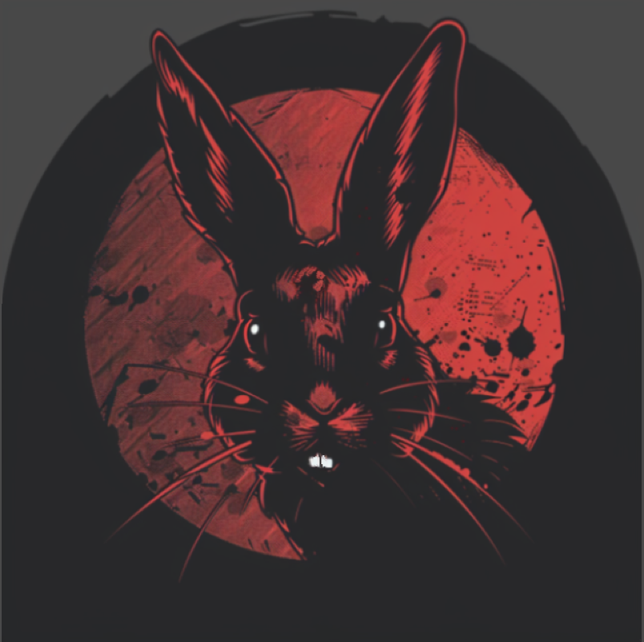

# Patricia Chess Engine

  

  
  [![License][license-badge]][license-link]
  [![Release][release-badge]][release-link]
  [![Commits][commits-badge]][commits-link]
  

The most aggressive chess engine ever written, Patricia is a killer bunny who will not hesitate to ram as many pieces as possible down your throat.

  

# Aggression
The metric that Patricia's aggression claims are based off of is Stefan Pohl's [EAS tool (found here)](https://www.sp-cc.de/eas-ratinglist.htm), which is the most well known and well regarded tool for determining the aggressiveness of chess engines. It looks at a combination of factors, such as sacrifice rate, short win rate, and unnecessary draw rate, and outputs a score that captures how "exciting" an engine tends to play.

The average engine's EAS score generally falls between 50,000 and 100,000. The most aggressive top engine is Stockfish, due to its extreme tactical ability; it has an EAS score of 190,000. The most aggressive engine of any notable strength that Stephen Pohl has ever seen is Velvet 4.1.0, which topped out at a remarkable EAS Score of 280,000.

Patricia, with an EAS score of 425,000 in gauntlet testing, is leaps and bounds above any engine that has ever existed in terms of attacking, sacrificing, and playing stylishly. 

It's worth noting that Patricia is still well into superhuman territory, with an estimated CCRL elo of 3100-3150; she'll lose badly to top engines, but will still crush any human.

  

# What Patricia currently does to increase aggressiveness
- Default contempt of 80 centipawns for draws deemed avoidable
- Neural network retrained on "aggressive" positions filtered by a variety of criteria
- Asymmetrical evaluation; Patricia doesn't care if she gets sacrificed against, so all sacrifice bonuses apply to the original side to move only.
- Bonuses for going down in material compared to original position being searched
- Bonuses for being better off than what material would suggest
- Bonuses for sacrifices at root
- Bonuses for attacking the enemy king
- Bonus for opposite side castling
- If the above applies, bonus for open files towards enemy king
- Material scaling
- Game length evaluation scaling
- Lack of search techniques that aggressively prune moves that lose material. Patricia has no SEE pruning, and she orders bad captures right behind good captures instead of right at the end.

  

# Search Features
Patricia has a somewhat simple feature set of search features as of now. This is partly due to the aforementioned reason of not wanting to prune too many sacrifices away, and partly due to focusing more on increasing aggressiveness than strength.

- Alpha-Beta search with Quiescence Search and Transposition Tables
- Aspiration Windows
- Reverse Futility Pruning and Futility Pruning
- Null Move Pruning
- Late Move Reductions
- Late Move Pruning
- History Heuristic and Killer Move Heuristic
- Singular Extensions

  

# Evaluation and Filtering
Patricia's evaluation is a neural network with a 768x2->768->1 perspective arch, trained on 2.4 billion positions of my other engine [Willow's](https://github.com/Adam-Kulju/Willow) data. It has been additionally retrained on a filtered dataset of 10 million positions specially selected for being "aggressive positions", in order to increase Patricia's understanding of them and to make her more likely to play into similar positions.

Code for filtering programs are found in the utils/ directory, and are indentified as follows:
- <b>position_filter_1:</b> Saves positions with general compensation - i.e. being down significantly in material yet still having at least a playable position. (Note: I currently do not recommend using this one.)
- <b>position_filter_2:</b> Saves positions where one side's king is exposed and under attack by enemy pieces.
- <b>position_filter_3:</b> Saves positions where one side has a major space advantage.
- <b>position_filter_4:</b> Saves opposite side castling positions with lots of material on the board and one side attempting a pawn storm.
- <b>position_filter_5:</b> Saves positions where one side is significantly behind in development.
- <b>position_filter_6:</b> Saves positions where one side can't castle and has an open king. This is somewhat similar to 2 but doesn't take into account attackers and uses a different method for calculating defensive strength.
- <b>position_filter_7:</b> Saves positions where many pieces are able to move near, are near, or are pointing at the enemy king. This uses a simple but effective ray calculator instead of a full mobility calculation.
- <b>position_filter_8:</b> Saves positions where one side has an extremely powerful minor piece that can't be traded off easily. Many such positions result from exchange sacrifices and even if they don't the dominant piece is a long term advantage that often leads to dynamics down the line.

Patricia currently uses positions that were filtered out by scripts 2, 6, and 8, with duplicates removed.

Additionally, the `converter.cpp` file allows you to transform bullet-format data into text data, so that you can then use the filtering scripts on the resulting file.

All filtering programs are run with the command `./[exe] [input.txt] [output.txt]`. You'll have to compile the particular program that you want to run yourself, or you can ask me for a binary for a specific filtering method.

  

# Acknowledgements

- A huge shoutout to Stefan Pohl. His EAS Tool works wonderfully, makes properly and objectively testing for increase aggression possible, and is the measure by which Patricia development progressed. He was also very invested in Patricia's development and explained many features of the EAS tool to me so that I had a better understanding of what was a sacrifice and what wasn't. He has put a lot of time into quantifying style, and I am happy to have Patricia be a proof-of-concept and culmination of his ideas.

- Thanks to my friends at SweHosting as usual, for being supportive, for suggesting ideas, and for spreading Patricia propaganda in the Stockfish Discord server :crabgrab:

- Thanks to all the people interested in an aggressive chess engine. The support I got in my developer log on Talkchess is really nice to see. I'm glad people care about style in chess too, rather than just ELO!

  

# Other

Instructions for downloading/building Patricia can be found in the Releases section. If you know UCI protocol, you can run Patricia directly, otherwise she will work with any major GUI ([Arena](http://www.playwitharena.de/), [BanksiaGUI](https://banksiagui.com/), etc.)

If you think Patricia is a cool project, please spread the word of it! There are lots of people interested in an aggressive engine, whether it be for sparring or for other purposes, and greater awareness of what *should* be the undisputed queen of style would make their wish come true.

[license-badge]: https://img.shields.io/github/license/Adam-Kulju/Patricia?style=for-the-badge
[release-badge]: https://img.shields.io/github/v/release/Adam-Kulju/Patricia?style=for-the-badge
[commits-badge]: https://img.shields.io/github/commits-since/Adam-Kulju/Patricia/latest?style=for-the-badge

[license-link]: https://github.com/Adam-Kulju/Patricia/blob/main/LICENSE
[release-link]: https://github.com/Adam-Kulju/Patricia/releases/latest
[commits-link]: https://github.com/Adam-Kulju/Patricia/commits/main
